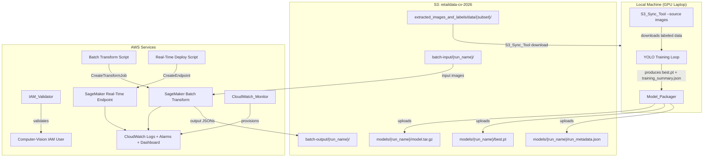

# Design Document: AWS Model Deployment

## Overview

This document describes the technical design for the AWS infrastructure layer of the
retail computer vision analytics pipeline. The system bridges a locally-trained
YOLO-based model and AWS inference services.

The pipeline has five stages:

1. **Data download** — `S3_Sync_Tool` pulls labeled image subsets or raw video from
   `retaildata-cv-2026` to the local machine for training.
2. **Model upload** — After training, `S3_Sync_Tool` uploads `best.pt` and
   `run_metadata.json` to `s3://retaildata-cv-2026/models/{run_name}/`.
3. **Artifact packaging** — `Model_Packager` bundles `best.pt`, `code/inference.py`,
   `code/requirements.txt`, and `model_config.json` into `model.tar.gz` and uploads
   it to S3.
4. **Inference deployment** — Either the batch transform script or the real-time
   endpoint deploy script submits a SageMaker job using the uploaded artifact.
5. **Monitoring** — `CloudWatch_Monitor` provisions log groups, metric alarms, and a
   dashboard for the live inference workload.

The design adopts **SageMaker Batch Transform** as the primary deployment target
because the retail analytics use case processes recorded footage offline in bulk.
A **SageMaker Real-Time Endpoint** is defined as an optional secondary configuration
for on-demand single-frame queries.

---

## Architecture

### End-to-End Pipeline Diagram



### Deployment Architecture Selection

#### Architecture Evaluation Table

| Criterion | SageMaker Batch Transform | SageMaker Real-Time Endpoint | Lambda + API Gateway |
|---|---|---|---|
| Cost per inference | Low — pay only while job runs | High — always-on instance cost | Low — pay per invocation |
| Cold-start latency tolerance | High — batch jobs tolerate minutes | Low — must be <30 s for dashboards | Low — cold starts can be 10–30 s |
| Input payload size | Large — up to multi-GB S3 prefix | 20 MB per request | 6 MB hard limit on payload |
| GPU availability | **Suitable** — ml.g4dn.xlarge available | **Suitable** — ml.g4dn.xlarge available | **Unsuitable** — no GPU Lambda |
| Operational complexity | Low — single API call + poll | Medium — endpoint lifecycle mgmt | High — custom container required |
| **Verdict** | **Selected (primary)** | **Conditional (secondary)** | **Unsuitable** |

**Selected architecture: SageMaker Batch Transform (primary)**

Justification:
- (a) Detection results are consumed only after full job completion, not per-request —
  batch transform matches this read-after-completion pattern exactly.
- (b) Batch transform incurs no always-on endpoint costs between jobs, making it
  significantly lower cost for scheduled offline workloads.

**Secondary optional: SageMaker Real-Time Endpoint**

For store dashboards requiring single-frame on-demand queries:
- Instance type: `ml.g4dn.xlarge`
- Request payload: single JPEG or PNG frame, max 20 MB, max 1920×1080
- Cold-start latency tolerance: **≤ 30 seconds**
- Endpoint should be deleted after 30 minutes of idle time (zero invocations) to
  avoid unnecessary cost.

#### Instance Type Justification: ml.g4dn.xlarge

The `ml.g4dn.xlarge` instance provides an NVIDIA T4 GPU with 16 GB VRAM.

Published benchmarks from [Ultralytics docs](https://docs.ultralytics.com/modes/benchmark/)
and community measurements show that a YOLO nano model at 416–640 px input runs at
approximately **3–8 ms per frame on a T4 GPU**, versus **150–350 ms per frame on a
CPU-only `ml.m5.xlarge`** instance. This is roughly a 30–50× speedup on GPU.

For a batch of 1,000 frames:
- GPU (T4): ~5–8 seconds total inference time
- CPU (m5.xlarge): ~150–350 seconds total inference time

`ml.g4dn.xlarge` is the minimum GPU instance in the SageMaker catalog. The next
tier up (`ml.g4dn.2xlarge`) doubles cost without proportionally improving throughput
for single-model nano workloads that fit comfortably in T4 VRAM.

---

## Components and Interfaces

### 1. S3_Sync_Tool (`scripts/s3_sync.py`)

Single-entrypoint script with two operation modes: **download** and **upload**.

#### Credential Bootstrap (shared across all scripts)

```python
def load_env_and_validate(required_vars: list[str]) -> dict[str, str]:
    """
    Load .env from project root via python-dotenv.
    Raises SystemExit(1) with descriptive message if .env is absent
    or any required_vars entry is missing/empty.
    Returns: dict of resolved env var values.
    """
```

#### Download Mode

```python
def download_dataset(
    bucket: str,
    source: Literal["images", "videos"],  # default "images"
    subset: str | None,                   # None → download all
    max_files: int | None,                # None → no limit; ≤0 raises SystemExit(1)
    store_ids: list[str] | None,          # videos mode only
    local_dest: Path,
) -> DownloadManifest:
    """
    Downloads image/label pairs or video files from S3 to local_dest.
    Skips files whose S3 ETag matches the local MD5 checksum.
    Retries each file up to 3 times with exponential backoff (base=1s).
    Writes download_manifest.json to local_dest on completion.
    Raises SystemExit(1) on invalid params or exhausted retries.
    """

def compute_etag_match(local_path: Path, s3_etag: str) -> bool:
    """
    Returns True if MD5(local_path) hex == s3_etag (stripping quotes).
    Handles multipart ETags (etag contains '-') by returning False
    (conservative: always re-download multipart-uploaded files).
    """

def exponential_backoff_retry(
    fn: Callable,
    max_retries: int = 3,
    base_seconds: float = 1.0,
) -> Any:
    """
    Calls fn(). On ClientError or network exception, waits base_seconds * 2^attempt
    and retries. Raises the last exception after max_retries exhausted.
    """
```

#### Upload Mode

```python
def upload_model(
    local_pt_path: Path,
    bucket: str,
    run_name: str | None,   # None → auto-generate
    overwrite: bool = False,
) -> str:
    """
    Validates .pt extension and file existence.
    Validates/generates run_name.
    Checks for existing S3 object; aborts unless overwrite=True.
    Uploads best.pt, verifies size match, uploads run_metadata.json.
    Returns the S3 URI of the uploaded model.
    Raises SystemExit(1) on any validation or upload failure.
    Uses abort_multipart_on_failure context manager.
    """

def generate_run_name() -> str:
    """Returns run_{YYYYMMDDTHHmmssZ} using datetime.utcnow()."""

def validate_run_name(name: str) -> None:
    """
    Raises ValueError if name contains characters outside [a-zA-Z0-9_-]
    or is longer than 128 characters.
    """
```

### 2. IAM_Validator (`scripts/iam_validator.py`)

```python
REQUIRED_S3_ACTIONS = [
    "s3:GetObject", "s3:PutObject", "s3:DeleteObject", "s3:ListBucket",
]
REQUIRED_SAGEMAKER_ACTIONS = [
    "sagemaker:CreateModel", "sagemaker:CreateEndpointConfig",
    "sagemaker:CreateEndpoint", "sagemaker:InvokeEndpoint",
    "sagemaker:DeleteEndpoint", "sagemaker:DescribeEndpoint",
]
REQUIRED_LOGS_ACTIONS = [
    "logs:CreateLogGroup", "logs:CreateLogStream", "logs:PutLogEvents",
]

@dataclass
class ValidationResult:
    verification_result: Literal["PASSED", "PERMISSIONS_MISSING", "CONNECTION_FAILED"]
    permissions_missing: list[dict]  # AWS policy statement dicts, empty on PASSED

def validate_iam_permissions(
    iam_client,
    user_name: str,
    sagemaker_role_arn: str,
) -> ValidationResult:
    """
    Simulates and collects effective permissions using iam:SimulatePrincipalPolicy.
    Builds a list of missing policy statement objects for any absent action.
    Returns ValidationResult; never raises — errors are encoded in the result.
    """

def run_validator() -> None:
    """
    CLI entrypoint. Loads .env, validates env vars, calls validate_iam_permissions,
    prints JSON result to stdout, exits with appropriate return code.
    """
```

### 3. Model_Packager (`scripts/package_model.py`)

```python
def validate_training_summary(summary_path: Path) -> dict:
    """
    Loads training_summary.json and validates presence and types of:
      model_architecture (str), input_size (int), num_classes (int > 0),
      class_names (list[str] with len == num_classes),
      dataset_version (str), training_device (str).
    Raises ValueError identifying the first invalid/missing field.
    """

def create_model_archive(
    model_path: Path,
    inference_py: Path,
    requirements_txt: Path,
    training_summary: dict,
    output_dir: Path,
) -> Path:
    """
    Creates model.tar.gz with layout:
      best.pt
      code/inference.py
      code/requirements.txt
      code/model_config.json   ← generated from training_summary
    Verifies integrity by extracting to a tempdir.
    Returns path to model.tar.gz.
    """

def verify_archive_integrity(archive_path: Path) -> None:
    """
    Extracts archive to tempfile.mkdtemp().
    Asserts best.pt exists and size >= 1024 bytes.
    Asserts code/inference.py exists and size >= 1 byte.
    Raises ValueError identifying missing or undersized files.
    Cleans up tempdir on exit.
    """

def upload_archive(
    archive_path: Path,
    bucket: str,
    run_name: str,
    s3_client,
) -> str:
    """
    Uploads model.tar.gz to s3://{bucket}/models/{run_name}/model.tar.gz.
    Uses abort_multipart_on_failure to ensure no partial objects.
    Returns the full S3 URI.
    """
```

### 4. Inference Handler (`code/inference.py`)

The SageMaker PyTorch inference container calls these four entry points:

```python
def model_fn(model_dir: str) -> YOLO:
    """
    Loads best.pt from model_dir using ultralytics.YOLO(model_path).
    Reads model_config.json from model_dir.
    Validates that model.model.nc == config['num_classes'].
    If mismatch: logs structured JSON error, sets global ERROR_STATE = True.
    Returns the YOLO model object (callable).
    """

def input_fn(request_body: bytes, content_type: str) -> torch.Tensor:
    """
    Accepts content_type in {'image/jpeg', 'image/png'}.
    Decodes bytes via Pillow Image.open(BytesIO(request_body)).
    Converts to RGB, resizes to (416, 416), converts to float32.
    Normalises pixel values to [0.0, 1.0] by dividing by 255.0.
    Returns tensor of shape [1, 3, 416, 416].
    Raises ValueError('Unsupported content type: {content_type}') for other types.
    """

def predict_fn(input_tensor: torch.Tensor, model: YOLO) -> dict:
    """
    Records start time, runs model(input_tensor), records end time.
    Returns dict with raw results and inference_time_ms.
    Exceptions propagate to output_fn for structured error handling.
    """

def output_fn(prediction: dict, accept: str) -> tuple[str, str]:
    """
    Serialises prediction to InferenceResponse JSON.
    On exception from predict_fn: logs structured JSON error with
      {level, error_type, error_message, input_shape, timestamp},
      returns HTTP 500 without re-raising.
    Returns (json_string, 'application/json').
    """
```

**Error State Handling**: A module-level `_ERROR_STATE: bool = False` flag is set by
`model_fn` on class mismatch. All subsequent calls to `output_fn` immediately return
HTTP 500 with a message directing the operator to redeploy with a consistent model
and config.

### 5. Batch Transform Script (`scripts/run_batch_transform.py`)

```python
def submit_batch_transform(
    sm_client,
    model_name: str,
    input_s3_uri: str,
    output_s3_uri: str,
    instance_type: str = "ml.g4dn.xlarge",
) -> str:
    """
    Calls CreateTransformJob with:
      - TransformJobName: retail-cv-batch-{timestamp}
      - Tags: [Project=retail-cv-analytics, ManagedBy=aws-model-deployment-spec]
      - BatchStrategy: SingleRecord
      - TransformInput: S3DataType=S3Prefix, SplitType=None
      - TransformOutput: S3OutputPath=output_s3_uri
    Returns the job name.
    Raises SystemExit(1) on API failure.
    """

def poll_until_terminal(
    sm_client,
    job_name: str,
    poll_interval_seconds: int = 60,
    max_duration_seconds: int = 86400,
) -> str:
    """
    Polls DescribeTransformJob every poll_interval_seconds.
    Prints current status and job name on each poll to stdout.
    Returns terminal status string on completion.
    Raises SystemExit(1) if max_duration_seconds exceeded.
    On DescribeTransformJob exception: retries up to 3 times
      with 30-second interval before SystemExit(1).
    """

def handle_terminal_state(sm_client, job_name: str, status: str) -> None:
    """
    'Completed': prints output URI and job duration, exits 0.
    'Failed'/'Stopped': retrieves FailureReason (or prints fallback),
      exits non-zero.
    """
```

### 6. Real-Time Endpoint Deploy Script (`scripts/deploy_realtime.py`)

```python
def deploy_realtime_endpoint(
    sm_client,
    model_name: str,
    endpoint_name: str,
    instance_type: str = "ml.g4dn.xlarge",
    initial_instance_count: int = 1,
) -> None:
    """
    Creates EndpointConfig and Endpoint via boto3.
    Polls DescribeEndpoint until status is 'InService' or 'Failed'.
    On success: prints endpoint name, status, and HTTPS invocation URL.
    On failure: retrieves FailureReason and exits non-zero.
    Registers Application Auto Scaling policy:
      ScaleOut: InvocationsPerInstance > 10 req/min (1-period, 1-min eval)
      ScaleIn:  InvocationsPerInstance < 5 req/min for 5 consecutive 1-min periods
      Min: 1 instance, Max: 4 instances
    """
```

### 7. CloudWatch_Monitor Setup Script (`scripts/setup_cloudwatch.py`)

```python
def ensure_log_group(
    cw_client,
    log_group_name: str,
    retention_days: int = 30,
) -> None:
    """
    Creates log group if absent; updates retention policy if it differs.
    Never recreates an existing log group (idempotent).
    """

def put_latency_alarm(
    cw_client,
    endpoint_name: str,
    sns_arn: str | None,
) -> None:
    """
    Creates or updates alarm 'retail-cv-latency-p99' on metric ModelLatency
    (namespace AWS/SageMaker, EndpointName dimension):
      ExtendedStatistic=p99, Threshold=4000 ms,
      Period=300s, EvaluationPeriods=1, DatapointsToAlarm=1,
      ComparisonOperator=GreaterThanThreshold,
      TreatMissingData=notBreaching.
    Adds SNS action if sns_arn is provided; omits it otherwise.
    Prints warning to stdout if sns_arn is None.
    """

def put_5xx_alarm(cw_client, endpoint_name: str, sns_arn: str | None) -> None:
    """
    Creates or updates alarm 'retail-cv-5xx-errors' on Invocation5XXErrors
    (namespace AWS/SageMaker):
      Statistic=Sum, Threshold=5,
      Period=300s, EvaluationPeriods=1, DatapointsToAlarm=1,
      TreatMissingData=notBreaching.
    """

def put_dashboard(cw_client, endpoint_name: str, use_gpu_metrics: bool) -> None:
    """
    Creates or updates dashboard 'retail-cv-inference-dashboard'.
    Widgets: ModelLatency (p50/p90/p99), Invocations, Invocation5XXErrors.
    Final widget: GPUUtilization if use_gpu_metrics else CPUUtilization.
    Uses put_dashboard (idempotent by design in CloudWatch API).
    """

def run_setup(endpoint_name: str, deployment_type: Literal["realtime", "batch"]) -> None:
    """
    CLI entrypoint. Reads SNS ARN from CLOUDWATCH_ALARM_SNS_ARN env var (optional).
    Calls ensure_log_group, put_latency_alarm, put_5xx_alarm, put_dashboard.
    """
```

---

## File / Directory Layout

```
retail-cv-analytics/
├── .env                          # AWS credentials (gitignored)
├── .gitignore
├── docs/
│   └── handoff_contract.md       # Req 9.5 — step-by-step deployment checklist
├── code/                         # SageMaker inference handler (bundled into model.tar.gz)
│   ├── inference.py              # model_fn, input_fn, predict_fn, output_fn
│   └── requirements.txt          # ultralytics, torch, Pillow (pinned versions)
├── scripts/
│   ├── s3_sync.py                # S3_Sync_Tool: download and upload operations
│   ├── iam_validator.py          # IAM_Validator: permission verification
│   ├── package_model.py          # Model_Packager: tar.gz creation and upload
│   ├── run_batch_transform.py    # Batch Transform: submit, poll, handle result
│   ├── deploy_realtime.py        # Real-time Endpoint: create, verify, scale
│   └── setup_cloudwatch.py       # CloudWatch_Monitor: log groups, alarms, dashboard
├── scripts/common/
│   ├── __init__.py
│   ├── env_loader.py             # load_env_and_validate() shared by all scripts
│   └── retry.py                  # exponential_backoff_retry() utility
├── models/                       # Local model outputs (gitignored)
│   └── {run_name}/
│       ├── best.pt
│       ├── training_summary.json
│       └── model.tar.gz          # generated by Model_Packager
├── data/                         # Local downloaded training data (gitignored)
│   └── extracted_images_and_labels/
│       └── data/
│           └── {subset}/
│               ├── images/
│               └── labels/
├── download_manifest.json        # Written to data/ by S3_Sync_Tool
└── tests/
    ├── test_s3_sync.py
    ├── test_iam_validator.py
    ├── test_package_model.py
    ├── test_inference.py
    ├── test_batch_transform.py
    └── test_cloudwatch_monitor.py
```

### SageMaker model.tar.gz Internal Layout

The SageMaker PyTorch inference container requires the following structure:

```
model.tar.gz
├── best.pt                  # YOLO model weights
└── code/
    ├── inference.py         # four inference handler functions
    ├── requirements.txt     # pinned dependencies installed on container boot
    └── model_config.json    # generated from training_summary.json
```

The container extracts this archive to `/opt/ml/model/` before calling `model_fn`.

---

## Data Models

### `download_manifest.json`

Written to the local destination directory after every download invocation.

```json
{
  "invocation_timestamp": "2025-01-15T10:30:00Z",
  "source": "images",
  "subset": "Picking And Returning",
  "total_files_downloaded": 42,
  "total_files_skipped": 158,
  "files": [
    {
      "s3_key": "extracted_images_and_labels/data/Picking And Returning/images/frame_001.jpg",
      "size_bytes": 204800
    }
  ]
}
```

Schema constraints:
- `total_files_downloaded` ≥ 0
- `total_files_skipped` ≥ 0
- `files` is an empty array when `total_files_downloaded` is 0
- `subset` is `null` when `--subset` was not provided
- `source` is one of `"images"` or `"videos"`

### `run_metadata.json`

Uploaded to `s3://retaildata-cv-2026/models/{run_name}/run_metadata.json`.

```json
{
  "run_name": "run_20250115T103000Z",
  "upload_timestamp": "2025-01-15T10:30:05Z",
  "local_file_size_bytes": 6291456,
  "python_script_version": "1.0.0"
}
```

Schema constraints:
- `upload_timestamp` is UTC ISO 8601 string
- `local_file_size_bytes` is a positive integer
- `python_script_version` is a semantic version string matching the S3_Sync_Tool's
  `__version__` constant

### `training_summary.json`

Produced by the local training pipeline. Validated by `Model_Packager` before packaging.

```json
{
  "model_architecture": "yolov8n",
  "input_size": 416,
  "num_classes": 5,
  "class_names": ["Picking", "Returning", "Walking", "Standing", "Unknown"],
  "dataset_version": "v3.2.0",
  "training_device": "cuda:0"
}
```

Schema constraints:
- `model_architecture`: non-empty string
- `input_size`: positive integer
- `num_classes`: positive integer > 0
- `class_names`: list of strings with `len(class_names) == num_classes`
- `dataset_version`: non-empty string
- `training_device`: non-empty string (e.g., `"cuda:0"`, `"cpu"`)

### `model_config.json`

Generated by `Model_Packager` from `training_summary.json` and bundled inside
`model.tar.gz` at `code/model_config.json`.

```json
{
  "num_classes": 5,
  "class_names": ["Picking", "Returning", "Walking", "Standing", "Unknown"],
  "input_size": 416
}
```

Schema constraints:
- Exactly three fields: `num_classes`, `class_names`, `input_size`
- Values copied directly from `training_summary.json` with no transformation

### Inference Response JSON

Returned by the real-time endpoint and written per-image by batch transform.

```json
{
  "detections": [
    {
      "label": "Picking",
      "confidence": 0.87,
      "bbox": [0.12, 0.34, 0.45, 0.78]
    }
  ],
  "inference_time_ms": 6.4,
  "model_run_name": "run_20250115T103000Z"
}
```

Schema constraints:
- `confidence` in range [0.0, 1.0]
- `bbox` is a list of exactly four floats each in range [0.0, 1.0]
  representing `[x_min, y_min, x_max, y_max]` in normalised coordinates
- `inference_time_ms` > 0.0
- `detections` may be an empty list when no objects are detected

---

## Error Handling

### Retry Utility (`scripts/common/retry.py`)

All network operations use a shared `exponential_backoff_retry` helper:

```python
def exponential_backoff_retry(
    fn: Callable[[], T],
    max_retries: int = 3,
    base_seconds: float = 1.0,
    retryable_exceptions: tuple = (ClientError, ConnectionError, TimeoutError),
) -> T:
    """
    Attempt 0: call fn() immediately.
    On retryable exception:
      wait = base_seconds * (2 ** attempt)
      wait attempt+1 (attempt ∈ {0,1,2})
    After max_retries attempts exhausted: re-raise the last exception.
    Non-retryable exceptions propagate immediately.
    """
```

For batch transform polling errors (`DescribeTransformJob`), the interval is fixed at
30 seconds (not exponential) as the requirement specifies a fixed interval.

### Error Exit Conventions

All scripts follow the same convention:
- Exit code `0` — success
- Exit code `1` — validation error (bad parameters, missing files, missing env vars)
- Exit code `1` — AWS API error (non-retryable or retries exhausted)
- All error messages are written to `stdout` (matching the requirements) rather than
  `stderr` to simplify log collection

### Partial Upload Prevention

The `abort_multipart_on_failure` context manager wraps every S3 multipart upload:

```python
@contextmanager
def abort_multipart_on_failure(s3_client, bucket: str, key: str):
    """
    Tracks the multipart upload ID. On any exception inside the block:
      calls s3_client.abort_multipart_upload(Bucket=bucket, Key=key, UploadId=...)
    to ensure no orphaned parts remain in S3.
    """
```

For single-part uploads (files < 8 MB), boto3 uses a simple PUT which is atomic;
no multipart cleanup is needed.

### IAM Validation Error Shape

When permissions are missing, the validator produces this JSON to stdout:

```json
{
  "verification_result": "PERMISSIONS_MISSING",
  "permissions_missing": [
    {
      "Effect": "Allow",
      "Action": ["sagemaker:CreateEndpoint"],
      "Resource": "*"
    }
  ]
}
```

Each element in `permissions_missing` is a valid IAM policy statement that can be
attached directly via `aws iam put-user-policy`.

### Inference Handler Error Logging

Errors in the SageMaker container are logged to the CloudWatch log stream as
structured JSON entries:

```json
{
  "level": "ERROR",
  "error_type": "RuntimeError",
  "error_message": "CUDA out of memory",
  "input_shape": [1, 3, 416, 416],
  "timestamp": "2025-01-15T10:30:05.123Z"
}
```

If the log write itself fails (e.g., permission denied), the handler catches the
secondary exception and still returns the HTTP 500 response — error isolation
prevents cascading failures.

---

## Technology Choices

| Library | Version | Purpose |
|---|---|---|
| `boto3` | `>=1.34,<2` | All AWS API calls (S3, SageMaker, CloudWatch, IAM) |
| `python-dotenv` | `>=1.0,<2` | Loading `.env` credentials in all scripts |
| `ultralytics` | `>=8.0,<9` | YOLO model loading and inference in `inference.py` |
| `torch` | `>=2.1,<3` | Tensor operations in `inference.py`; already a transitive dependency of ultralytics |
| `Pillow` | `>=10.0,<11` | Image decoding in `input_fn` (JPEG/PNG → PIL Image → tensor) |
| `pytest` | `>=8.0,<9` | Test runner |
| `hypothesis` | `>=6.0,<7` | Property-based testing library |
| `pytest-mock` | `>=3.12,<4` | Mocking boto3 clients in unit tests |

**Rationale for Pillow over OpenCV**: Pillow has a smaller install footprint and no
native dependencies beyond libjpeg/libpng, making it appropriate for the SageMaker
container where image sizes are restricted. The inference handler does not need
video frame decoding.

**Rationale for Hypothesis**: Hypothesis is the standard PBT library for Python,
provides shrinking of failing examples, and integrates cleanly with pytest.

---

## Security Considerations

### Credential Handling

All five scripts call `load_env_and_validate()` from `scripts/common/env_loader.py`
as their first action. This function:

1. Calls `dotenv.load_dotenv(dotenv_path=find_dotenv(), override=False)` to load
   the project `.env` file without overriding shell environment variables that may
   already be set.
2. Checks each required variable by name. If any are absent or empty, it prints
   `Missing required environment variable(s): {names}` and calls `sys.exit(1)`
   **before** making any AWS API calls.
3. Never prints credential values — only variable names.

### What `.env` Must Contain

```
AWS_ACCESS_KEY_ID=...
AWS_SECRET_ACCESS_KEY=...
AWS_DEFAULT_REGION=ap-southeast-2
SAGEMAKER_EXECUTION_ROLE_ARN=arn:aws:iam::123456789012:role/SageMakerExecutionRole
CLOUDWATCH_ALARM_SNS_ARN=arn:aws:sns:ap-southeast-2:123456789012:retail-cv-alerts
```

`CLOUDWATCH_ALARM_SNS_ARN` is optional; the CloudWatch setup script proceeds without
it and prints a warning.

### `.gitignore` Requirements

The following paths must be listed in `.gitignore`:

```
.env
models/
data/
```

This prevents credentials, large model files, and training data from being committed
to version control.

### IAM Least-Privilege Principle

The `Computer-Vision` IAM user is granted only the actions explicitly listed in
Requirements 3.1–3.4. No wildcard `*` actions are permitted on any resource.
S3 permissions are scoped to `arn:aws:s3:::retaildata-cv-2026` and
`arn:aws:s3:::retaildata-cv-2026/*`. CloudWatch Logs permissions are scoped to
`arn:aws:logs:*:*:log-group:/aws/sagemaker/*`.

### No Hard-Coded Secrets

- No credential values appear in any script file or configuration file.
- The `run_metadata.json` schema explicitly excludes credential fields.
- The `model_config.json` bundled in the archive contains only model topology
  metadata (classes, input size) — no infrastructure secrets.

---

## Correctness Properties

*A property is a characteristic or behavior that should hold true across all valid
executions of a system — essentially, a formal statement about what the system should
do. Properties serve as the bridge between human-readable specifications and
machine-verifiable correctness guarantees.*

### Property 1: Invalid --max-files values are always rejected

*For any* integer value less than or equal to 0 supplied as `--max-files`, the
S3_Sync_Tool SHALL reject it with a non-zero exit code and print an error describing
the valid range.

**Validates: Requirements 1.2**

### Property 2: ETag-based skip/re-download is consistent for all files

*For any* set of local files and their corresponding S3 ETags, files whose local
MD5 matches the ETag are always skipped and files whose MD5 differs are always
re-downloaded — regardless of file content, size, or path.

**Validates: Requirements 1.4**

### Property 3: Download manifest accurately reflects every download run

*For any* set of files (with varying ETag match statuses), the written
`download_manifest.json` SHALL contain exactly the non-skipped files in its `files`
array, and `total_files_downloaded` and `total_files_skipped` SHALL sum to the total
number of files considered.

**Validates: Requirements 1.7**

### Property 4: Any invalid --source value is rejected

*For any* string supplied as `--source` that is not `"images"` or `"videos"`, the
S3_Sync_Tool SHALL reject with a non-zero exit code and print a message listing the
valid values.

**Validates: Requirements 1.9**

### Property 5: run_name validation rejects all non-conforming strings

*For any* string containing characters outside `[a-zA-Z0-9_\-]` or exceeding 128
characters, the run_name validator SHALL raise an error identifying the constraint
violated; for any string within those bounds, it SHALL accept.

**Validates: Requirements 2.2, 5.10**

### Property 6: Upload size verification holds for all files

*For any* local `.pt` file, after a successful upload the S3 object size SHALL equal
the local file size in bytes.

**Validates: Requirements 2.5**

### Property 7: run_metadata.json always contains required fields after upload

*For any* successful model upload, the uploaded `run_metadata.json` SHALL contain
all four required fields (`run_name`, `upload_timestamp`, `local_file_size_bytes`,
`python_script_version`) with correct types.

**Validates: Requirements 2.6**

### Property 8: Missing permissions output contains exactly the absent permissions

*For any* subset of required IAM permissions being absent, the `permissions_missing`
array in the validator output SHALL contain policy statements covering exactly those
absent actions — no more, no fewer.

**Validates: Requirements 3.5**

### Property 9: Any combination of missing env vars is fully reported

*For any* non-empty subset of required environment variables (`AWS_ACCESS_KEY_ID`,
`AWS_SECRET_ACCESS_KEY`, `AWS_DEFAULT_REGION`, `SAGEMAKER_EXECUTION_ROLE_ARN`) that
is absent or empty, the affected script SHALL name every missing variable in its
error output and exit with a non-zero return code.

**Validates: Requirements 3.9, 9.6**

### Property 10: model.tar.gz always contains all required files

*For any* valid set of input files (`best.pt`, `code/inference.py`,
`code/requirements.txt`), the resulting `model.tar.gz` SHALL contain all three files
at their specified paths within the SageMaker PyTorch layout.

**Validates: Requirements 5.1**

### Property 11: Archive integrity check enforces minimum size thresholds for all archives

*For any* `model.tar.gz`, if `best.pt` is absent or smaller than 1 KB, or if
`code/inference.py` is absent or empty, the integrity check SHALL raise a descriptive
error identifying the specific failing file before any upload is attempted.

**Validates: Requirements 5.4**

### Property 12: Missing required packaging inputs always cause early failure

*For any* combination of missing files from `{best.pt, code/inference.py,
code/requirements.txt}`, the Model_Packager SHALL raise an error identifying every
missing file and SHALL NOT create or upload any archive.

**Validates: Requirements 5.5**

### Property 13: input_fn produces correctly normalised tensors for all valid images

*For any* valid JPEG or PNG image of any resolution, `input_fn` SHALL return a
`torch.Tensor` with dtype `float32`, shape `[1, 3, 416, 416]`, and all pixel values
in the range `[0.0, 1.0]`.

**Validates: Requirements 5.7**

### Property 14: Unsupported Content-Type always triggers an error response

*For any* content type string other than `"image/jpeg"` or `"image/png"`, `input_fn`
SHALL raise a `ValueError` that `output_fn` converts to an HTTP 400 error response,
without invoking the model.

**Validates: Requirements 5.8**

### Property 15: output_fn always produces a structurally valid JSON response

*For any* model prediction output, `output_fn` SHALL return a JSON string parseable
to a dict containing `detections`, `inference_time_ms` (> 0.0), and
`model_run_name`; each detection SHALL have `label` (string), `confidence`
(float in [0.0, 1.0]), and `bbox` (list of four floats each in [0.0, 1.0]).

**Validates: Requirements 5.9**

### Property 16: predict_fn exceptions always yield HTTP 500 with structured error log

*For any* exception type raised by `predict_fn`, `output_fn` SHALL catch it, log a
structured JSON entry containing `error_type`, `error_message`, and `timestamp`, and
return an HTTP 500 response without propagating the exception.

**Validates: Requirements 5.11**

### Property 17: Batch transform jobs always include required tags

*For any* invocation of the batch transform script with valid parameters, the
`CreateTransformJob` API call SHALL include both tags `Project=retail-cv-analytics`
and `ManagedBy=aws-model-deployment-spec`.

**Validates: Requirements 6.8**

### Property 18: DescribeTransformJob polling exceptions always trigger 3 retries

*For any* exception type raised by `DescribeTransformJob` during polling, the script
SHALL retry up to 3 times with a 30-second interval and exit with a non-zero return
code after all retries are exhausted.

**Validates: Requirements 6.9**

### Property 19: inference handler logs always contain required fields on error

*For any* unhandled exception in the inference handler, the logged JSON entry SHALL
contain `level`, `error_type`, `error_message`, `input_shape`, and `timestamp`.

**Validates: Requirements 8.2**

### Property 20: CloudWatch monitor setup is idempotent for any number of invocations

*For any* CloudWatch state (alarms and dashboards may or may not pre-exist), running
the setup script multiple times SHALL produce the same final alarm and dashboard
configuration without creating duplicate resources.

**Validates: Requirements 8.6**

### Property 21: training_summary.json field validation identifies all missing/invalid fields

*For any* JSON document missing any of the required fields or containing a field with
an incorrect type, `validate_training_summary` SHALL raise a `ValueError` that
identifies the specific invalid or missing field by name.

**Validates: Requirements 9.2**

### Property 22: model_config.json embedded in archive matches training_summary values

*For any* valid `training_summary.json`, the `model_config.json` bundled inside
`model.tar.gz` SHALL contain `num_classes`, `class_names`, and `input_size` values
that are identical to those in the source `training_summary.json`.

**Validates: Requirements 9.3**

### Property 23: Class count mismatch always prevents inference and returns HTTP 500

*For any* pair of `(model_class_count, config_num_classes)` where the values differ,
`model_fn` SHALL log a structured error entry and set the error state, causing all
subsequent inference requests to return HTTP 500.

**Validates: Requirements 9.4**

---

## Testing Strategy

### Overview: Dual Testing Approach

Unit/property tests verify correctness of the Python logic. Integration tests verify
that scripts wire up to the correct AWS API calls with the correct parameters (using
mocked boto3 clients). Smoke tests cover documentation and environment setup checks.

### Property-Based Testing with Hypothesis

The property-based tests (Properties 1–23 above) are implemented using
[Hypothesis](https://hypothesis.readthedocs.io/) and run with pytest. Each property
test runs a minimum of **100 iterations** per test case.

Tag format for each property test comment:
```python
# Feature: aws-model-deployment, Property N: <property_text>
```

Key Hypothesis strategies used:
- `st.integers(max_value=0)` — for invalid --max-files values
- `st.binary()` wrapped in JPEG/PNG headers — for image generation
- `st.text(alphabet=st.characters(whitelist_categories=('Lu','Ll','Nd')))` — for run names
- `st.frozensets(st.sampled_from(ALL_REQUIRED_ACTIONS))` — for permission subsets
- `st.from_regex` — for content-type strings

### Unit Tests (Example-Based)

Example-based unit tests cover:
- Default `--source images` behavior
- Default `--instance-type ml.g4dn.xlarge` behavior
- Auto-generated run name format validation
- `--overwrite` guard on existing S3 objects
- Successful upload print output and exit code 0
- IAM validation success path (exit 0 + "IAM validation passed")
- Connection failure (CONNECTION_FAILED result shape)
- Batch transform success and failure terminal states
- Real-time endpoint InService confirmation and failure retrieval
- CloudWatch SNS ARN handling (set vs unset)
- All-files-skipped download → exit 0 + correct manifest

### Integration Tests (Mock-Based)

These tests use `pytest-mock` to intercept boto3 client calls:
- IAM `simulate_principal_policy` returns expected allow/deny sets
- CloudWatch `put_metric_alarm` is called with exact expected parameters
- CloudWatch `put_dashboard` produces correct widget JSON
- S3 `create_multipart_upload` / `abort_multipart_upload` are called on upload failure
- SageMaker `create_transform_job` includes required tags and default instance type

### Test Configuration

```
# pytest.ini
[pytest]
addopts = --tb=short
```

```python
# conftest.py
import hypothesis
settings = hypothesis.settings(max_examples=100, deadline=None)
hypothesis.settings.register_profile("ci", max_examples=200)
```

Run all tests:
```bash
pytest tests/ --run  # single-pass, no watch mode
```

Run only property tests:
```bash
pytest tests/ -m "hypothesis"
```
